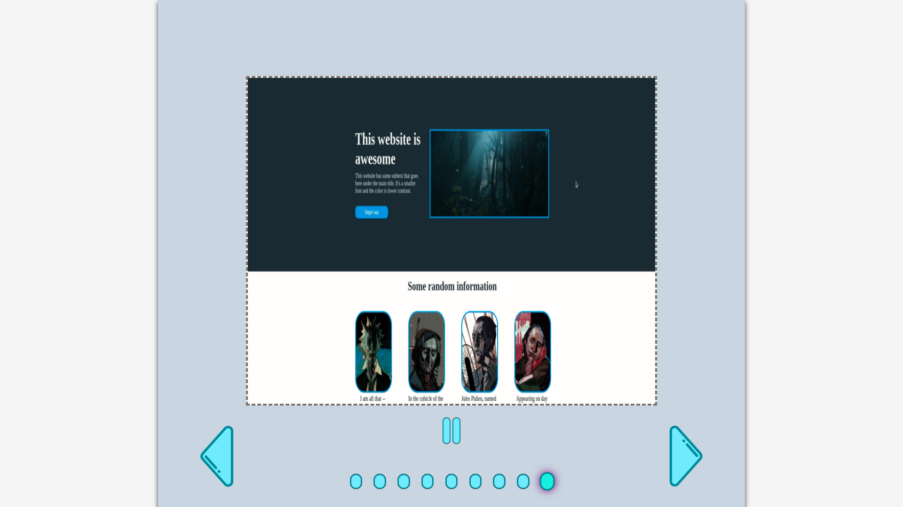

# image-slider

Build as part of OTP's Dynamic User Interface lesson.

A simple design based around Timeouts and transitions, showcasing different image gifs.

#About

This is a simple project, that can easily be incorporated into a bigger design if need arises. The user is able to toggle through the various images and pause to inspect each one of them .

<a href="https://kiwasthal.github.io/image-slider/">Take a look.</a>

